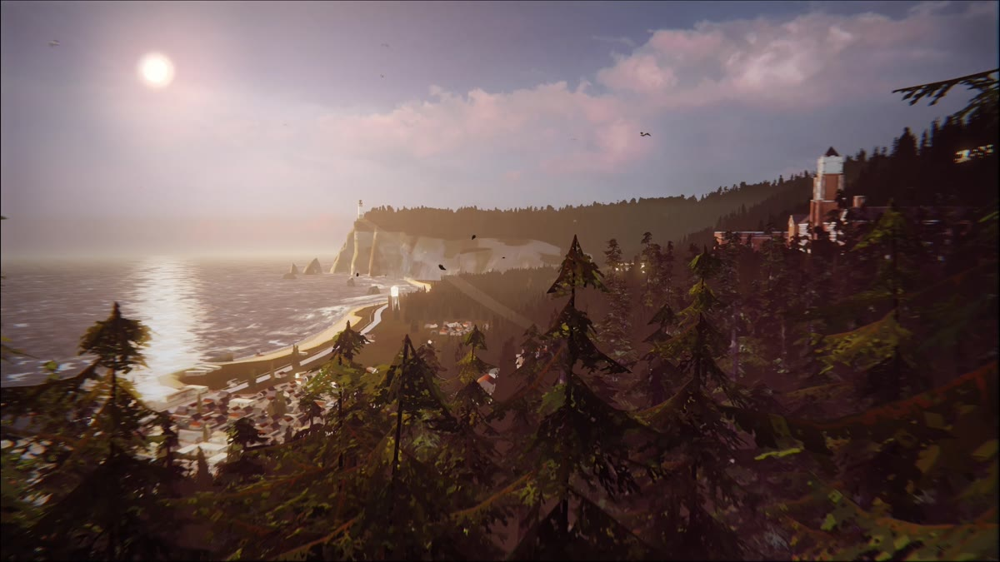
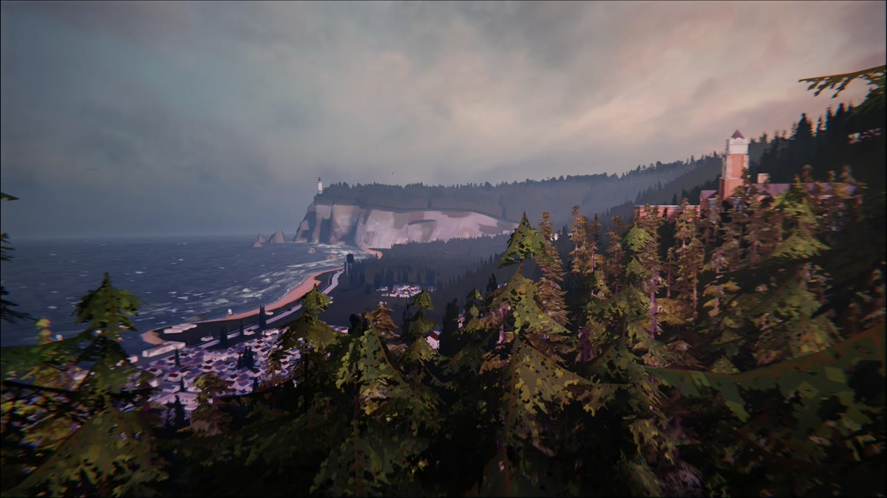
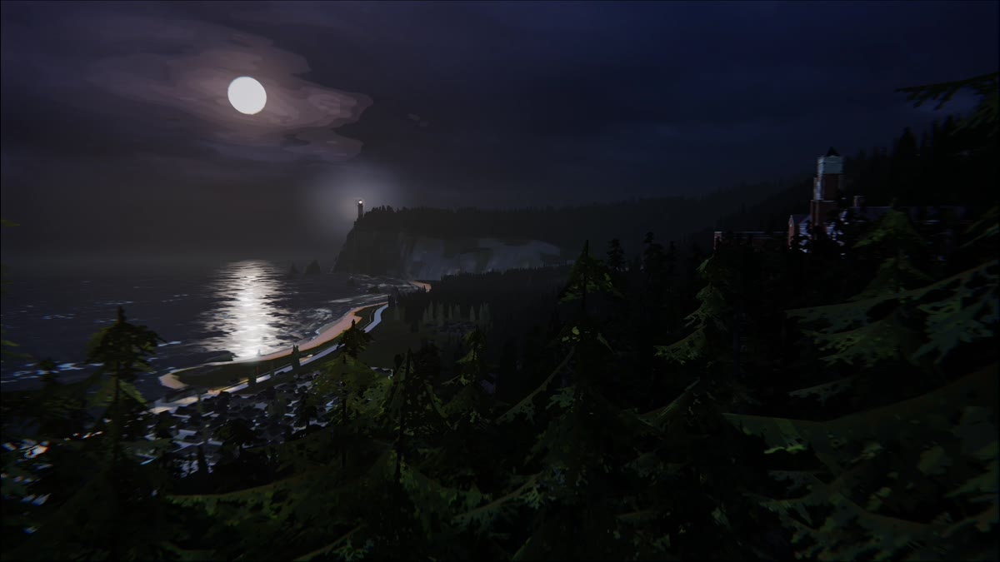
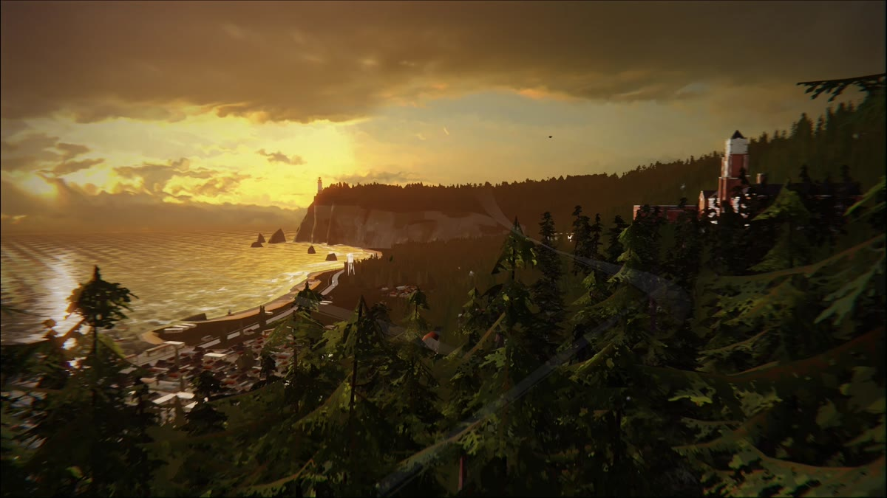
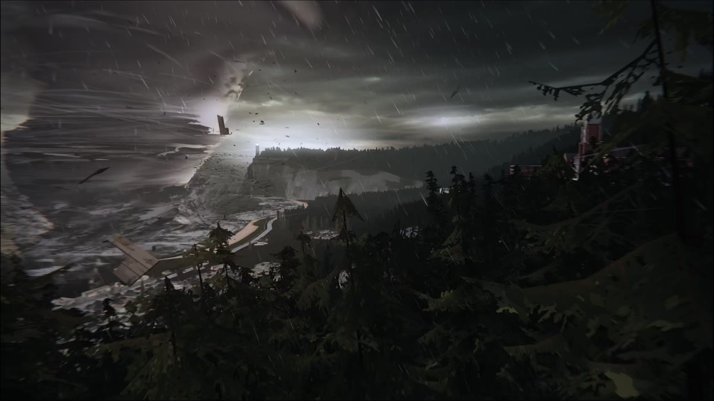

# Arcadia Weather

Inspired by **Life is Strange**, Arcadia Weather brings the view over Arcadia Bay to your Windows desktop. The sky changes with your local weather and time of day, from daylight and sunset to a quiet night or a storm.

Just choose your location and leave it on **Automatic**. Or pick your favorite scene and keep it there. You can have the sunset for a little longer.<br><br>

<br><br>

## Key Feature

- **Five animated scenes** from Arcadia Bay, with the original video audio.
- **Automatic weather and time of day.** Checks your local weather every five minutes and chooses the matching scene.
- **Manual scene selection.** Keep any scene until you switch back to Automatic or restart the app.
- **Location search.** Search for a city or district, enter coordinates, or let Windows fill them with **Use my location**.
- **Wallpaper preview and playback controls.** Pause, resume, mute, and adjust the volume from the main page.
- **Light and dark mode.** Your choice is saved immediately and remembered next time. You can also follow the Windows theme.
- **Display settings.** Choose a monitor, Fill or Fit, and Celsius or Fahrenheit.
- **Runs in the tray.** Optional Windows startup and automatic pausing while another fullscreen app covers the selected display.
- **One EXE when packaged.** The videos, .NET runtime, and video player are bundled together. No separate VLC installation or video setup.<br><br>

## Preview

These are stills from the five wallpaper scenes. In the app, each one plays as a looping video.

| Day 1 | Day 2 | Day 3 | Day 4 | Day 5 |
| :---: | :---: | :---: | :---: | :---: |
|  |  |  |  |  |
| Daylight | Cloudy | Night | Evening | Rain & storm |

### Automatic or Manual

Automatic follows the weather at your selected location. Rain wins over everything, including night. Clouds replace daylight and evening, but leave the night scene alone.

| Condition | Scene |
| --- | --- |
| Rain, drizzle, showers, or thunderstorms at any hour | **Day 5** |
| Night without rain, even if it is cloudy | **Day 3** |
| Cloudy morning, afternoon, or evening without rain | **Day 2** |
| Clear evening | **Day 4** |
| Clear morning or afternoon | **Day 1** |

Day starts at sunrise, evening starts **one hour before sunset**, and night starts **30 minutes after sunset**, using your location's timezone. The weather refreshes every **five minutes**, as well as at startup and after waking.

For example, a cloudy afternoon shows Day 2. Once night arrives, it switches to Day 3. If rain starts, Day 5 takes over.

If you just wanna keep the evening view, click **Day 4**. That puts the app in Manual, where the weather won't change your choice. Select **Automatic** when you want it to follow the weather again. A new app session starts in Automatic.<br><br>

## How to Use

You'll need **Windows 10 or 11, x64**. If you already have the packaged `ArcadiaWeather.exe`, open it directly. To make the EXE from this repository, follow [Build from Source](#build-from-source) below.

1. Open **ArcadiaWeather.exe**. The default location is Bangkok, Thailand.
2. Go to **Settings → Location** and search for your city or district. You can also enter latitude and longitude, or click **Use my location** to ask Windows for your position.
3. Check the location and timezone, then click **Save settings**.
4. Return to **Wallpaper** and leave **Automatic** on, or choose one of the five scenes.
5. Use the playback controls to pause or turn on the sound. Audio is muted by default on a fresh install.
6. In **Settings → Display**, choose your monitor and how the wallpaper fits. In **Settings → Windows**, choose whether to start with Windows or pause during fullscreen apps.

The **Dark mode** switch saves as soon as you use it. Other settings need **Save settings**. Windows location access is a one-time lookup when you press the button; the app doesn't track your position in the background.

Closing the window keeps the wallpaper running in the tray. Double-click the butterfly tray icon to reopen it, or choose **Exit** from its menu to stop the app and reveal your normal Windows background.<br><br>

## Tech Stack

- **C# / .NET 10 / WPF** — Windows interface and application logic.
- **LibVLCSharp / libVLC** — wallpaper video and audio playback.
- **Win32** — desktop wallpaper hosting, tray integration, and window controls.
- **Open-Meteo** — weather, sunrise/sunset, timezone lookup, and city search.
- **HTML / CSS / JavaScript** — the editable UI prototypes included in the repository.<br><br>

## Build from Source

You'll need **Windows x64**, a **.NET 10 SDK**, and **PowerShell**.

The repository includes the app source, tests, scene images, preview clips, and HTML prototypes. **The five full-length videos and generated EXE are not included in Git.** Supply the original videos separately with these filenames:

```text
Arcadia Bay Day 1 Sound AAC.mp4
Arcadia Bay Day 2 Sound AAC.mp4
Arcadia Bay Day 3 Sound AAC.mp4
Arcadia Bay Day 4 Sound AAC.mp4
Arcadia Bay Day 5 Sound AAC.mp4
```

Clone the project and point the build at that folder:

```powershell
git clone https://github.com/Ikkyuuuu/Arcadia-Weather.git
cd Arcadia-Weather
.\build.ps1 -VideoSource "C:\path\to\the\five\videos" -SingleExe
```

This runs the tests and creates:

```text
dist/ArcadiaWeather-1.5.3-single/ArcadiaWeather.exe
```

That EXE contains everything needed to run the app. `-VideoSource` is only used while building; people running the finished app don't need to choose any video paths.

For test commands, packaging options, and implementation details, see the [development guide](docs/DEVELOPMENT.md).<br><br>

## Note

- The bundled EXE is about **2 GB**. First launch needs roughly another **2 GB** for extracted files and may take a little longer. Later launches reuse that cache.
- Put the EXE where you want to keep it before enabling **Start with Windows**. Exit an older running version from the tray before opening a new one.
- Weather and city search need internet. Videos play offline; if weather becomes unavailable, the app uses recent cached data for up to an hour, then follows the time of day.
- Weather comes from model estimates, so a five-minute check doesn't mean a new observation every time.
- Wallpaper playback currently targets **one selected monitor**. It pauses on lock or sleep, and can pause for fullscreen apps.
- Settings and logs stay in `%LOCALAPPDATA%\ArcadiaWeather`. The app has no account system or analytics.<br><br>

## Source

**Inspiration & footage** &nbsp;:&nbsp; Life is Strange / Arcadia Bay<br>
**Weather & location search** &nbsp;:&nbsp; [Open-Meteo](https://open-meteo.com/)<br>
**Video playback** &nbsp;:&nbsp; [LibVLCSharp](https://code.videolan.org/videolan/LibVLCSharp) / [VideoLAN](https://www.videolan.org/vlc/libvlc.html)<br><br>

This is an unofficial fan project. Life is Strange artwork and footage belong to their respective rights holders. The application source is available under the [MIT license](LICENSE); third-party media and libraries retain their own terms. See [third-party notices](THIRD-PARTY-NOTICES.txt) for credits and licenses.
